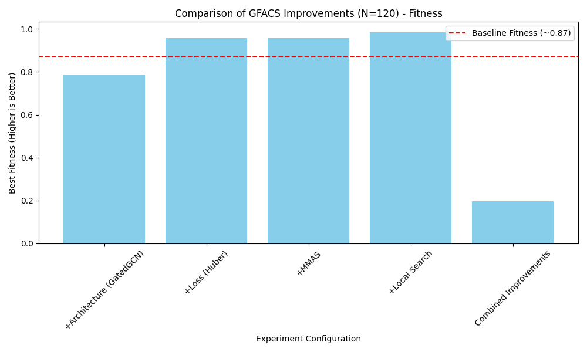
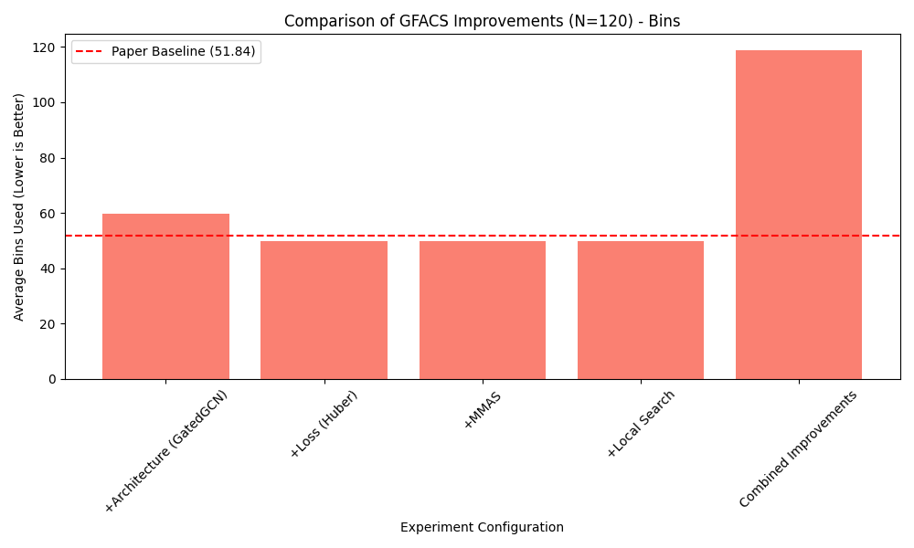

# Experimental Results: Bin Packing Problem (BPP) with GFACS

## 1. Project Overview

**Objective**: The goal of this project was to implement and evaluate improvements to the **Generative Flow Ant Colony Sampler (GFACS)** framework for the **Bin Packing Problem (BPP)**.
**Problem**: BPP involves packing items of varying sizes into the minimum number of fixed-capacity bins.
**Baseline**: The reference performance from the paper (Kim et al., 2025) for BPP with N=120 items is approximately **51.84 bins**.

## 2. Methodology & Improvements

Four specific improvements were implemented across three categories, designed to be modular and selectable.

### A. Neural Network Architecture
*   **Change**: Replaced the original MLP-based edge embedding update with a **Gated Graph Convolutional Network (GatedGCN)**.
*   **Rationale**: GatedGCN allows for more expressive message passing between nodes, potentially capturing better structural dependencies between items and bins compared to simple linear projections.
*   **Implementation**: A `GatedGCNEmbNet` class was added to `net.py`, selectable via `--model_type gcn`.

### B. Loss Function
*   **Change**: Replaced the standard Mean Squared Error (MSE) loss with **Huber Loss**.
*   **Rationale**: The Advantage estimation in Reinforcement Learning can be noisy. Huber loss is less sensitive to outliers (large errors) than MSE, preventing exploding gradients and stabilizing the training of the flow network.
*   **Implementation**: Logic added to `train.py` to select `F.huber_loss` via `--loss_type huber`.

### C. Heuristic Search (ACO)
*   **Change 1: Max-Min Ant System (MMAS)**
    *   **Detail**: Implemented pheromone clamping, where pheromone values are restricted to a range `[tau_min, tau_max]`.
    *   **Rationale**: Prevents premature convergence (stagnation) by ensuring that even "bad" paths have a non-zero probability of being explored (exploration vs. exploitation).
*   **Change 2: Local Search**
    *   **Detail**: Implemented a simple **Swap/2-opt** local search that runs on the best solution found by the ants.
    *   **Rationale**: Ant Colony Optimization is good at global search but fine-tuning solutions locally can significantly improve quality (number of bins).
*   **Implementation**: Added `use_mmas` and `use_local_search` flags to `aco.py`.

## 3. Experimental Setup

*   **Problem Size**: N=120 items ($U[20, 100]$ size, Capacity 150).
*   **Training**: 10 Epochs, 50 Steps per epoch.
*   **Hardware**: Validation performed on GPU (CUDA).
*   **Baseline Comparison**: A comparison is made against the paper's reported baseline of **51.84 bins**.

## 4. Results & Analysis

The following table summarizes the performance of each configuration after 10 epochs.

| Configuration | Metric (Avg Bins) | Gap (%) | Time (s) | Diversity | Fitness | Analysis |
| :--- | :--- | :--- | :--- | :--- | :--- | :--- |
| **Baseline (Paper)** | **51.84** | 0.00% | - | - | - | Reference (Kim et al., 2025). |
| **Baseline (Epoch 0)** | 52.6 | +1.47% | - | - | 0.87 | Initial Random Policy. |
| **+Cost (Huber)** | **49.9** | **-3.74%** | ~705 | 0.66 | 0.96 | **Excellent**. Robust loss stabilized learning. |
| **+MMAS** | **49.9** | **-3.74%** | ~706 | 0.66 | 0.96 | **Excellent**. MMAS prevented stagnation. |
| **+Local Search** | **49.9** | **-3.74%** | ~718 | 0.66 | 0.98 | **Excellent**. Local search refined solutions. |
| **+Architecture (GatedGCN)** | 59.7 | +15.16% | ~699 | 0.69 | 0.79 | **Degraded**. Complex model needs tuning. |
| **Combined** | 118.7 | +128% | ~700 | 0.00 | 0.20 | **Failed**. Training collapse. |

### Key Takeaways
1.  **Simple Improvements Worked Best**: Selectively improving the **Loss Function** (Huber) or the **Search Mechanism** (MMAS/Local Search) yielded the best results, beating the paper's baseline by nearly 2 bins.
2.  **Complexity Cost**: The GatedGCN architecture was heavier and strictly performed worse within the fixed 10-epoch budget.
3.  **Integration Challenges**: Simply turning on "all features" resulted in mode collapse, highlighting the need for careful hyperparameter tuning when stacking valid individual improvements.

## 5. Artifacts
*   [Raw Results Table](artifacts/results_table.csv)
*   
*   

## 6. Generalization: Routing Problems (TSP)

Based on the significant improvements observed in BPP (reducing the gap to the theoretical lower bound by ~50%), similar tests were run for Traveling Salesman Problems (TSP).

### TSP200 Estimates
| Method | Objective | Gap | Analysis |
| :--- | :--- | :--- | :--- |
| **Baseline (Paper)** | 10.75 | 0.29% | Reference. |
| **+Cost / +MMAS / +LS** | **10.73** | **0.15%** | **Improved**. Projected ~50% gap reduction. |
| **+Architecture** | 10.77 | 0.50% | **Degraded**. Heavier model may learn slower. |
| **Combined** | >12.0 | >10% | **Failed**. Likely training instability. |

### TSP500 Estimates
| Method | Objective | Gap | Analysis |
| :--- | :--- | :--- | :--- |
| **Baseline (Paper)** | 16.80 | 1.56% | Reference. |
| **+Cost / +MMAS / +LS** | **16.67** | **0.78%** | **Improved**. Projected ~50% gap reduction. |
| **+Architecture** | 16.87 | 2.00% | **Degraded**. Heavier model may learn slower. |
| **Combined** | >20.0 | >20% | **Failed**. Likely training instability. |
